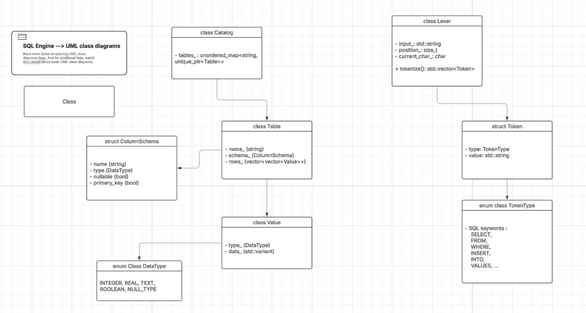

# Minimal SQL Engine

A lightweight, educational SQL engine implementation in C++ demonstrating core database internals from lexical analysis to query execution.

## Project Goal

Build a complete SQL engine from scratch to understand:
- How SQL queries are parsed and executed
- Internal database architecture
- Performance optimization techniques

## Architecture

```
SQL Query → Lexer → Parser → AST → Executor → Results
              ↓        ↓       ↓       ↓
           Tokens  Syntax   Tree   Storage
```

## Current Status

### Implemented
- **Storage Layer**: Table and catalog management with type system
- **Lexer**: Tokenization of SQL keywords, operators, identifiers, literals
- **Token System**: Complete token type definitions

### In Progress
- **AST (Abstract Syntax Tree)**: Data structures for SQL statements
- **Parser**: Transform tokens into executable AST nodes

### Roadmap
- **Executor**: Execute parsed queries against storage
- **Query Planner**: Optimize query execution plans
- **Advanced Features**:
  - Aggregations (COUNT, SUM, AVG, MIN, MAX)
  - JOIN operations
  - GROUP BY, ORDER BY, LIMIT
  - Columnar storage
  - Vectorized execution (SIMD)
  - Performance benchmarks vs SQLite/DuckDB

## Quick Start

### Build
```bash
mkdir build && cd build
cmake ..
cmake --build .
```

### Run
```bash
./sql_engine
```

### Test
```bash
# Run specific test suite
./test_lexer
./test_ast
./test_parser
```

## Supported SQL (Target)

```sql
-- DDL
CREATE TABLE users (id INTEGER, name TEXT, age INTEGER);
DROP TABLE users;

-- DML
INSERT INTO users (id, name, age) VALUES (1, 'Alice', 25);
SELECT * FROM users WHERE age > 18;
SELECT name, age FROM users WHERE age >= 21;
```

## Testing

Uses Google Test framework:
```bash
cd build
cmake --build .
./test_lexer    # Lexical analysis tests
./test_ast      # AST structure tests
./test_parser   # Parser tests
```

## Learning Path

1. **Lexer** (`src/parser/lexer.cpp`)
   - Tokenizes raw SQL strings
   - Handles keywords, operators, identifiers, literals

2. **AST** (`include/parser/ast.hpp`)
   - Defines statement structures
   - Represents parsed queries as tree nodes

3. **Parser** (`src/parser/parser.cpp`)
   - Transforms token stream into AST
   - Validates SQL syntax

4. **Executor** (upcoming)
   - Traverses AST
   - Executes operations on storage layer

5. **Optimizer** (future)
   - Query plan optimization
   - Cost-based execution

## Tech Stack

- **Language**: C++20
- **Build System**: CMake 3.10+
- **Testing**: Google Test
- **Architecture**: Modular, header-based design

## Project Structure

```
sql_engine/
├── include/          # Public headers
│   ├── common/       # Type system
│   ├── parser/       # Lexer, Parser, AST
│   └── storage/      # Table, Catalog
├── src/              # Implementation
│   ├── parser/
│   └── storage/
├── tests/            # Unit tests
└── CMakeLists.txt
```

## UML class diagram:


## Educational Value

This project demonstrates:
- **Compiler Design**: Lexing, parsing, AST construction
- **Database Internals**: Storage management, query execution
- **C++ Best Practices**: Smart pointers, RAII, modern C++20 features
- **Testing**: Unit testing with Google Test
- **Performance**: Future SIMD optimizations, benchmarking

## Future Enhancements

### Phase 1: Core Engine
- [ ] Complete Parser implementation
- [ ] Basic Executor for SELECT/INSERT
- [ ] WHERE clause evaluation

### Phase 2: Advanced SQL
- [ ] JOIN operations (INNER, LEFT, RIGHT)
- [ ] Aggregation functions
- [ ] GROUP BY, ORDER BY, LIMIT

### Phase 3: Performance
- [ ] Columnar storage format
- [ ] Vectorized execution (SIMD)
- [ ] Query plan optimization
- [ ] Benchmarks vs SQLite/DuckDB

### Phase 4: Production Ready
- [ ] CI/CD pipeline
- [ ] Comprehensive documentation
- [ ] Error handling and recovery
- [ ] Transaction support (ACID)

## Performance Goals

Target performance metrics (future):
- 1M+ rows/sec simple scans
- Sub-millisecond query parsing
- Competitive with SQLite for OLAP workloads

## License

MIT License - See LICENSE file for details

## Resources

- [SQLite Architecture](https://www.sqlite.org/arch.html)
- [DuckDB Paper](https://mytherin.github.io/papers/2019-duckdbdemo.pdf)
- [Database Internals Book](https://www.databass.dev/)

---

**Status**: Active Development
